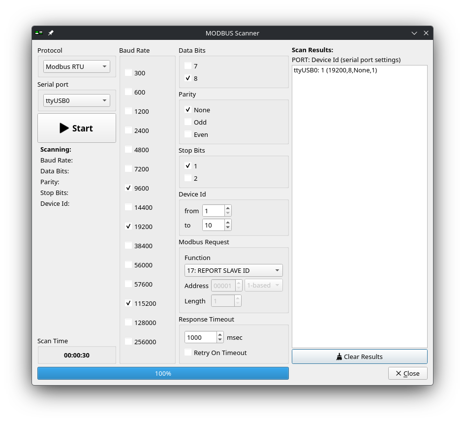
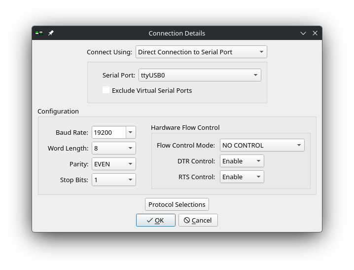
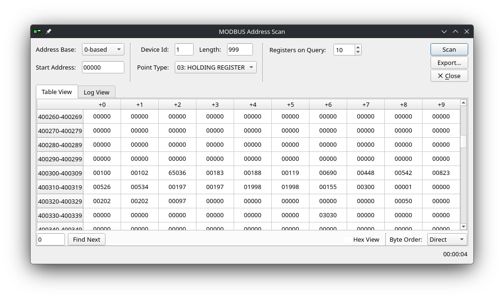
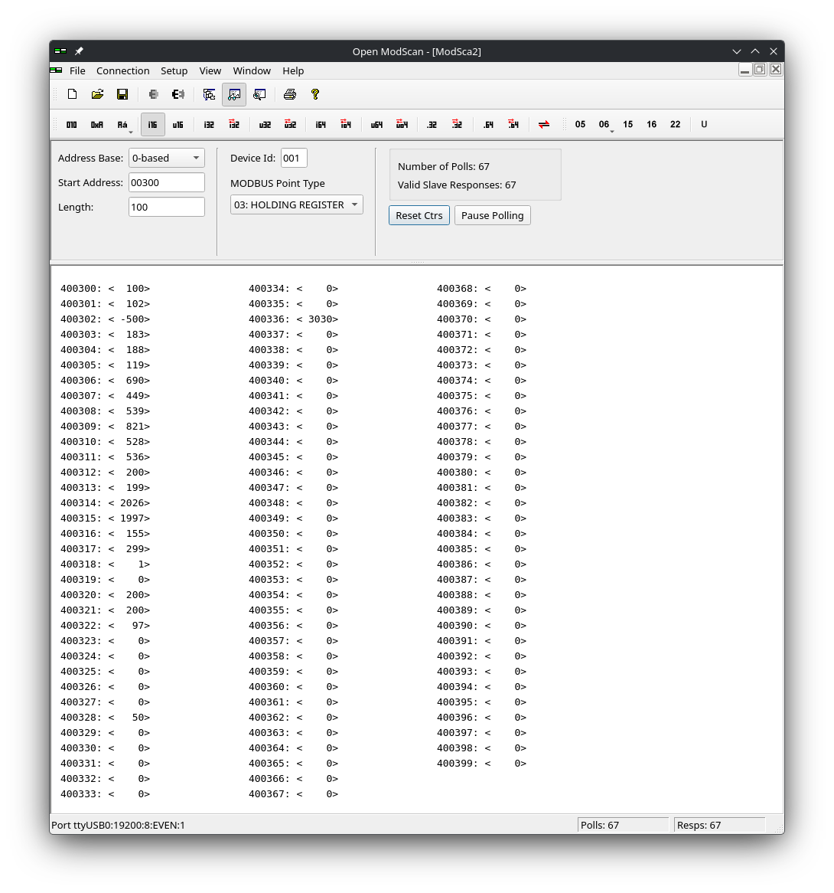

---
date:
  created: 2026-03-12
title: "Reverse engineering modbus protocol"
authors: [codedcactus]
tags: 
  - modbus
  - reverse engineering
---

# Reverse engineering modbus protocol
Recently, I started an effort to integrate the heat recovery ventilation (HRV) system into my Home Assistant setup. The house is equipped with a Zehnder ComfoAir E300, but after an extensive search I couldn't find any existing integrations for this particular model. I did however found an [issue](https://github.com/wichers/esphome-comfoair/issues/11) hinting at an undocumented connector that was connected to a level shifter, suggesting a serial interface was available.

{width="500"}
{width="500"}
/// caption
Schematic showing the IC connected to C3.
///

I disassembled the device, probed the PCB with a multimeter and followed the traces from the connector. The result can be seen in the figure above.
<!-- more -->

The IC is an [SN65HVD72](https://www.ti.com/product/SN65HVD72) half‑duplex RS‑485 chip, which confirms the presence of a serial interface. Since RS‑485 is commonly used with the Modbus RTU protocol, this was a good starting point to reverse engineer the interface.

## Modbus protocol
Modbus is a half‑duplex messaging protocol for communication between (industrial) devices. The underlying physical layer is often serial (RS232, RS422 or RS485) or TCP/IP. A complete description of the protocol can be found [here](https://www.modbustools.com/modbus.html). In short, it supports reading and writing binary (RTU) or ASCII data to four different register types. Each register contains a large range of addresses which hold data.

The different register types are:

- Coil Status -- (Read/Write) on/off values.
- Input Status -- (Read‑only) on/off values.
- Holding Registers -- (Read/Write) configuration values.
- Input Registers -- (Read‑only) measurements and statuses.

The first two registers only contain on/off data, while the last two support configuration and measurement values.

## Pre-requisites 
To start the discovery process, the following tools are required.

- Laptop with [OpenModScan](https://github.com/sanny32/OpenModScan) installed.
- USB‑TTL adapter.
- MAX485 module with automatic flow control.

Alternatively, a USB‑RS485 adapter can also be used.

!!! info "Linux users"

    Linux users might need to add their user to the `dialout` group. Run `sudo usermod -a -G dialout $USER` and logout for the change to take effect.

## Hardware setup
The hardware setup is simple: connect the USB‑TTL adapter to the MAX485 module, and the MAX485 module to the Modbus slave device (the Zehnder ComfoAir E300 in this case). The schematic below shows the port mapping.

``` 
    E300/E400              MAX485             USB‑TTL        Laptop      
+---------------+       +-----------+       +----------+     
|               |       |           |       |          |     +-----+
|         B-    o-------o B-    VCC o-------o 5V       |     |     |
|   C3    A+    o-------o A+    GND o-------o GND  USB 0- ---o USB |
|         GND   o-------o GND    RX o-------o RXD      |     |     |
|               |       |        TX o-------o TXD      |     +-----+
+---------------+       |           |       |          |  
                        +-----------+       +----------+  
```

!!! tip "Connection Issues"
 
    If you're having connection issues, try swapping the RX/TX connections and/or the A+ and B- connections. Some modules have labels that are swapped.

## Finding connection settings
With the hardware connected, it's time to start the discovery process. First, we have to find out what serial settings (baud rate, word length, parity and stopbit) are used by the Modbus slave. Open OpenModScan, then from the menu select: Connection-> MODUS Scanner.

Start by selecting the correct Protocol. Since we're using Modbus over serial interface, select `Modbus RTU`. Next, select the correct serial device. In this case the USB-TTL adapter is shown as ttyUSB0. However, this might be different depending on your setup.

Select the baud rate options you want to test (common options include 9600, 19200 and 115200, however other option are possible). Initially, avoid changing data bits, parity or stop bits. If no device is found, expand the search options.

Finally, pressing the start button will begin the scan using different baud rates and device Id's. The result of the scan are shown on the right.

{width="500"}
/// caption
Setup MODBUS Scanner.
///

In my case, a Modbus slave was found at 19200 baud with device Id: 1. With the connection settings and the device Id known, the next step is to identify the registers.

## Register Scan
As mentioned before, four different types of registers exists in the Modbus protocol. Each register has a wide range of addresses. Each address can contain 16 bit of data To find out which registers are holding data, a register scan can be performed.

First, connect to the USB‑TTL adapter via 'Connection -> Connect' and choose the serial settings discovered earlier.

{width="500"}
/// caption
Connection settings.
///

Once it has connected, the scan can be performed by navigation to: Setup -> Extended -> Address Scan. 

The `Device Id` can be set to the Id found in the previous step, in my case it is set to 1. Then the `point Type` can be set to one of the four registers as explained in the Modbus section. In this case, it is set to `holding register`. Finally, the `Registers on Query` determines the amount of addresses to reach simultaneously. A higher value will allow for a faster scan, but there can be a limit on the amount of data per command. When pressing the `Scan` button, the selected range of addresses will be queried from the slave device. 

{width="500"}
/// caption
Register scan.
///

The scan reveals which registers are populated and provides a starting point for mapping register values to device data.

## Mapping 
With populated addresses known, determine how to interpret the data. On OpenModScan's home screen, the second column offers options to interpret each register's contents (for example, as 16‑bit or 32‑bit integers). Interpreting as `i16` shows a 16‑bit integer per address. Interpreting as `i32` combines two consecutive addresses into a single 32‑bit value. The Address Base option controls whether combined values start at an odd or even address.

{width="500"}
/// caption
Parse message data.
///

Now that we know how to interpret the data, what is left is to map the register addresses to the device data. A good starting point can be to match the data shown on the device with the data shown in registers. For example, my ventilation unit can show the measured temperatures on the device display. This data can than be matched with the Modbus data. Note that sometimes the data can be stored as a fixed point value. For example, a temperature of 21.5 °C might be stored as an integer value of 215 in the Modbus data. Another common method is a fixed offset that has been applied to sensor data. In this case it might be more convenient to log the sensor data for a longer period of time, then try to match the data trend to the data.

## Conclusion
This post explained the basics of the Modbus protocol, how to identify serial connection settings and device ID, and how to access and map data in registers. The next step is to log and process the available data. If you're interested, you can find the complete project on [GitHub](https://github.com/CodedCactus/zehnder-comfoair).