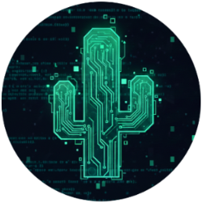

# CodedCactus

{ align=right }
Welcome! This site is a collection of my work and experiments at the intersection of hardware, software, and curiosity. I spend a lot of time building and modifying things — from smart home systems powered by Home Assistant and ESPHome, to custom 3D-printed parts and electronics projects.

You’ll find projects where I reverse-engineer devices, design and print components, and create practical solutions for everyday problems. Many of these builds combine automation, embedded systems, and hands-on prototyping.

This space serves as a project log — a place to document ideas, share what I learn, and explore new challenges along the way.

<!-- RECENTLY_UPDATED_DOCS -->

<!-- ---

## Start here

- Read the blog: [Blog home](blog/index.md)
- Browse all posts: [Archives](blog/archive/2026)

--- -->